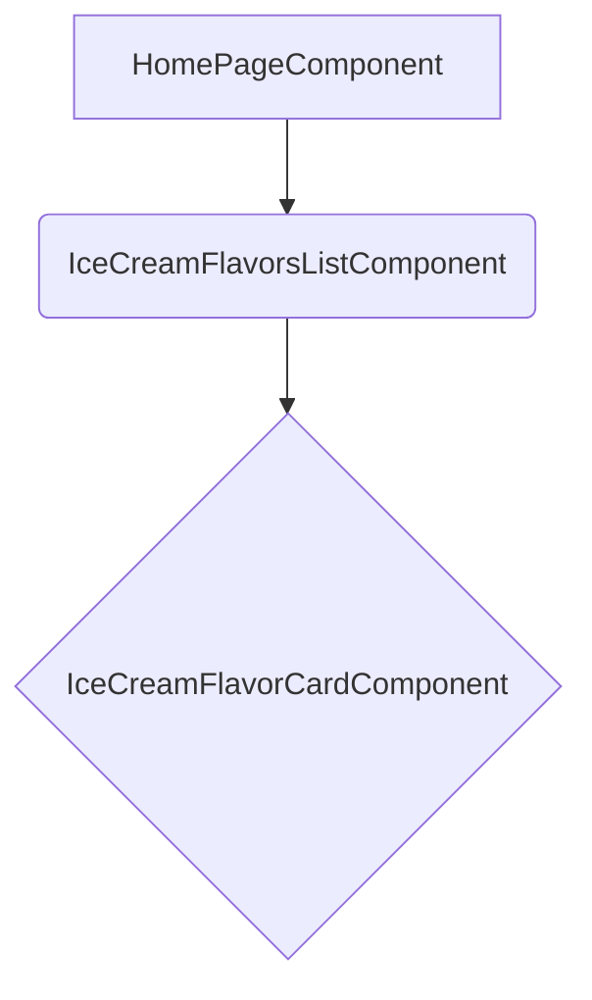

# Plan implementacji widoku: Lista Smaków Lodów

## 1. Przegląd

Celem tego widoku jest wyświetlenie aktualnie dostępnych smaków lodów na stronie głównej aplikacji. Widok ma charakter informacyjny i ma ułatwić klientom zapoznanie się z ofertą przed dokonaniem wyboru. Zgodnie z wymaganiami MVP, lista smaków będzie na razie zaszyta na stałe w kodzie aplikacji, ale zaimplementowana w sposób umożliwiający łatwą integrację z API w przyszłości.

## 2. Routing widoku

Komponent będzie częścią strony głównej, która jest dostępna pod główną ścieżką aplikacji:

- **Ścieżka**: `/` (root)

Komponent `IceCreamFlavorsListComponent` zostanie osadzony bezpośrednio w szablonie komponentu strony głównej (np. `HomePageComponent` lub `DashboardPageComponent`).

## 3. Struktura komponentów

Hierarchia komponentów będzie prosta i składać się z jednego głównego komponentu-kontenera oraz komponentu-prezentera.



- **`HomePageComponent`**: Strona główna aplikacji, która będzie zawierać listę smaków.
- **`IceCreamFlavorsListComponent`**: Komponent-kontener odpowiedzialny za pobranie danych o smakach (z serwisu) i wyświetlenie ich listy.
- **`IceCreamFlavorCardComponent`**: Komponent-prezenter odpowiedzialny za wyświetlanie informacji o pojedynczym smaku.

## 4. Szczegóły komponentów

### `IceCreamFlavorsListComponent`

- **Opis komponentu**: Główny komponent widoku, który pobiera listę smaków z `IceCreamFlavorService` i renderuje je za pomocą pętli, używając komponentu `IceCreamFlavorCardComponent` dla każdego smaku.
- **Główne elementy**: Nagłówek (np. `<h2>Dostępne smaki</h2>`) oraz kontener (`div`) z listą kart smaków (`app-ice-cream-flavor-card`).
- **Obsługiwane interakcje**: Brak interakcji użytkownika w tym komponencie.
- **Obsługiwana walidacja**: Komponent powinien obsłużyć scenariusz, w którym lista smaków jest pusta i wyświetlić odpowiedni komunikat (np. "Brak dostępnych smaków w tym momencie.").
- **Typy**: `FlavorVM[]`
- **Propsy**: Brak.

### `IceCreamFlavorCardComponent`

- **Opis komponentu**: Komponent prezentujący pojedynczy smak lodów. Wyświetla jego nazwę oraz informację o dostępności.
- **Główne elementy**: Element `div` stylizowany na kartę, zawierający nazwę smaku (`<h3>`) oraz etykietę dostępności (np. `<span>Dostępny</span>` lub `<span>Niedostępny</span>`).
- **Obsługiwane interakcje**: Brak.
- **Obsługiwana walidacja**: Brak.
- **Typy**: `FlavorVM`
- **Propsy**:
  - `flavor: FlavorVM` - Obiekt zawierający dane o smaku do wyświetlenia.

## 5. Typy

Na potrzeby widoku zdefiniowany zostanie jeden główny typ `ViewModel`.

- **`FlavorVM` (Flavor View Model)**
  Typ ten będzie reprezentował dane smaku lodów w warstwie prezentacji. Zostanie zdefiniowany w pliku `src/app/types/view-models.ts` lub bezpośrednio w komponencie, jeśli nie będzie reużywany.

  ```typescript
  export interface FlavorVM {
    id: number; // Unikalny identyfikator smaku
    name: string; // Nazwa smaku, np. "Czekoladowy"
    isAvailable: boolean; // Status dostępności smaku
  }
  ```

## 6. Zarządzanie stanem

Zarządzanie stanem będzie realizowane lokalnie w komponencie `IceCreamFlavorsListComponent`. Komponent ten będzie przechowywał listę smaków w swojej właściwości.

- **Zmienna stanu**: `flavors$: Observable<FlavorVM[]>`
- **Cel**: Przechowywanie strumienia z listą smaków pobraną z serwisu.
- **Sposób użycia**: W szablonie komponentu zostanie użyta dyrektywa `*ngIf` oraz potok `async` do subskrypcji strumienia i wyświetlenia danych. Nie ma potrzeby tworzenia dedykowanego hooka ani globalnego stanu (np. NgRx) dla tak prostej funkcjonalności.

## 7. Integracja API

Zgodnie z wymaganiami, w obecnej wersji nie będzie integracji z zewnętrznym API. Zamiast tego zostanie utworzony serwis `IceCreamFlavorService`, który będzie dostarczał zahardkodowane dane. Takie podejście ułatwi w przyszłości zamianę implementacji na rzeczywiste wywołanie HTTP bez konieczności modyfikacji komponentów.

- **Serwis**: `IceCreamFlavorService`
- **Lokalizacja**: `src/app/services/ice-cream-flavor.service.ts`
- **Metoda**: `getFlavors(): Observable<FlavorVM[]>`
- **Implementacja**: Metoda zwróci `Observable` (za pomocą `of()`) z tablicą obiektów `FlavorVM`.

## 8. Interakcje użytkownika

Widok ma charakter czysto informacyjny, w związku z czym nie przewiduje się żadnych interakcji ze strony użytkownika, takich jak klikanie, sortowanie czy filtrowanie.

## 9. Warunki i walidacja

Jedynym warunkiem weryfikowanym przez interfejs jest obecność smaków na liście.

- **Komponent**: `IceCreamFlavorsListComponent`
- **Warunek**: Sprawdzenie, czy tablica smaków zwrócona przez serwis nie jest pusta.
- **Obsługa**: Jeśli lista jest pusta, na ekranie powinien pojawić się komunikat informujący o braku dostępnych smaków. W przeciwnym razie, wyświetlana jest lista.

## 10. Obsługa błędów

Ponieważ dane są hardkodowane i dostarczane przez serwis w sposób synchroniczny (opakowany w `Observable`), ryzyko wystąpienia błędu jest minimalne. Mimo to, należy zaimplementować obsługę pustej listy smaków, co jest jedynym przewidywalnym "przypadkiem brzegowym". W przyszłości, po przejściu na API, mechanizm zostanie rozbudowany o obsługę błędów HTTP (np. 404, 500) i wyświetlanie stosownych komunikatów.

## 11. Kroki implementacji

1.  **Utworzenie typu `FlavorVM`**: Zdefiniuj interfejs `FlavorVM` w pliku `src/app/types/view-models.ts` (jeśli nie istnieje) lub w pliku komponentu.
2.  **Utworzenie serwisu `IceCreamFlavorService`**:
    - Wygeneruj serwis za pomocą Angular CLI: `ng generate service services/ice-cream-flavor`.
    - Zaimplementuj metodę `getFlavors(): Observable<FlavorVM[]>` zwracającą zahardkodowaną listę smaków.
3.  **Utworzenie komponentu `IceCreamFlavorCardComponent`**:
    - Wygeneruj komponent: `ng generate component components/ice-cream-flavor-card --standalone`.
    - Zdefiniuj `Input` `flavor` typu `FlavorVM`.
    - Zaimplementuj szablon HTML i style Tailwind CSS do wyświetlania nazwy i dostępności smaku.
4.  **Utworzenie komponentu `IceCreamFlavorsListComponent`**:
    - Wygeneruj komponent: `ng generate component components/ice-cream-flavors-list --standalone`.
    - Wstrzyknij `IceCreamFlavorService` w konstruktorze.
    - Utwórz publiczną właściwość `flavors$` i przypisz do niej wynik wywołania `iceCreamFlavorService.getFlavors()`.
    - W szablonie użyj `*ngIf="flavors$ | async as flavors"` do obsługi strumienia.
    - Zaimplementuj logikę warunkową: jeśli `flavors.length > 0`, wyświetl listę za pomocą `*ngFor`, w przeciwnym razie wyświetl komunikat o braku smaków.
5.  **Integracja z `HomePageComponent`**:
    - Zaimportuj `IceCreamFlavorsListComponent` do `HomePageComponent`.
    - Dodaj selektor `<app-ice-cream-flavors-list>` w szablonie `HomePageComponent`.
6.  **Testowanie**: Ręcznie zweryfikuj, czy lista smaków poprawnie wyświetla się na stronie głównej oraz czy komunikat o braku smaków pojawia się, gdy serwis zwróci pustą tablicę.
