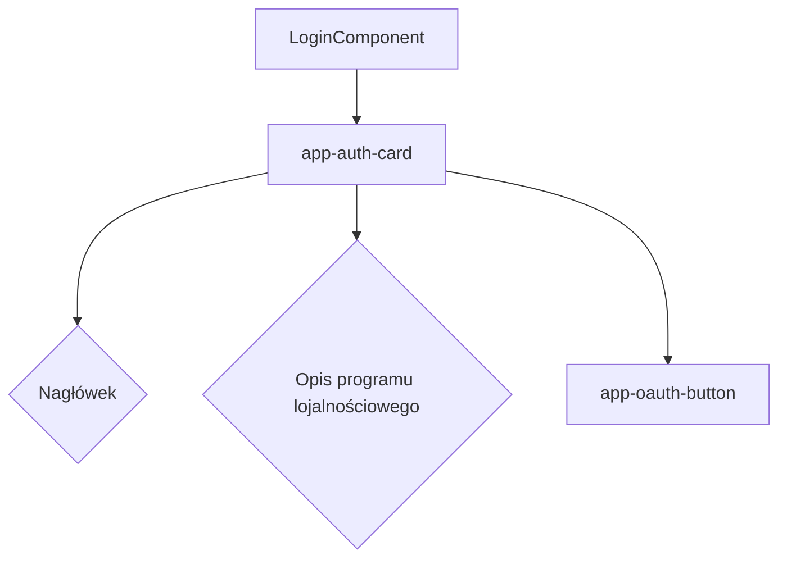

# Plan implementacji widoku Logowania

## 1. Przegląd
Widok logowania stanowi punkt wejścia dla powracających użytkowników aplikacji "Kulkomat". Jego głównym celem jest umożliwienie szybkiego i bezpiecznego uwierzytelnienia za pomocą zewnętrznego dostawcy tożsamości (Google), co jest zgodne z nowoczesnymi standardami i minimalizuje potrzebę zarządzania hasłami przez użytkownika. Widok ten ma również za zadanie w prosty sposób komunikować korzyści płynące z programu lojalnościowego, zachęcając do zalogowania.

## 2. Routing widoku
Widok będzie dostępny pod ścieżką `/login`. Zostanie zaimplementowany jako samodzielny komponent (standalone) z własną definicją trasy.

```typescript
// app.routes.ts
{
  path: 'login',
  loadComponent: () => import('./pages/login/login.component').then(m => m.LoginComponent)
}
```

## 3. Struktura komponentów
Widok będzie składał się z jednego głównego komponentu-strony, który będzie zawierał mniejsze, prezentacyjne komponenty UI.



- `LoginComponent`: Główny komponent strony, odpowiedzialny za logikę i układ.
- `app-auth-card`: Komponent opakowujący (wrapper) dla treści, zapewniający spójny wygląd kart uwierzytelniania.
- `app-oauth-button`: Przycisk do logowania przez Google, obsługujący interakcję użytkownika.

## 4. Szczegóły komponentów

### `LoginComponent`
- **Opis komponentu**: Główny komponent strony `/login`. Odpowiada za wyświetlenie interfejsu logowania, obsługę logiki związanej z procesem uwierzytelniania za pomocą `AuthService` oraz nawigację po pomyślnym zalogowaniu.
- **Główne elementy**: Komponent `app-auth-card` zawierający nagłówek, tekst informacyjny oraz przycisk `app-oauth-button`.
- **Obsługiwane interakcje**: Inicjowanie procesu logowania przez Google po kliknięciu przycisku.
- **Obsługiwana walidacja**: Brak walidacji po stronie frontendu; proces jest w pełni delegowany do Google i Supabase.
- **Typy**: Brak specyficznych typów DTO/ViewModel dla tego komponentu.
- **Propsy**: Brak.

### `app-auth-card` (komponent reużywalny)
- **Opis komponentu**: Karta UI służąca jako kontener dla formularzy i przycisków związanych z uwierzytelnianiem (logowanie, rejestracja). Zapewnia spójny branding i układ.
- **Główne elementy**: `<div>` stylizowany za pomocą Tailwind CSS, wykorzystujący `ng-content` do projekcji treści (nagłówka, opisu, przycisków).
- **Obsługiwane interakcje**: Brak.
- **Obsługiwana walidacja**: Brak.
- **Typy**: Brak.
- **Propsy**: Brak.

### `app-oauth-button` (komponent reużywalny)
- **Opis komponentu**: Specjalizowany przycisk do logowania za pomocą dostawcy OAuth (np. Google). Wyświetla logo dostawcy i odpowiedni tekst.
- **Główne elementy**: `<button>` zawierający `` (logo Google) oraz `<span>` (tekst przycisku).
- **Obsługiwane interakcje**: Emituje zdarzenie `(click)` w celu poinformowania komponentu nadrzędnego o zamiarze rozpoczęcia logowania.
- **Obsługiwana walidacja**: Brak.
- **Typy**: Brak.
- **Propsy**:
  - `provider: 'google' | 'facebook' | ...` (do ewentualnej rozbudowy)

## 5. Typy
Implementacja tego widoku nie wymaga definiowania nowych, niestandardowych typów DTO ani ViewModel. Proces logowania jest obsługiwany przez bibliotekę kliencką Supabase, która zarządza sesją i danymi użytkownika (`User` z `@supabase/supabase-js`).

## 6. Zarządzanie stanem
Stan uwierzytelnienia użytkownika będzie zarządzany globalnie w aplikacji za pomocą dedykowanego serwisu `AuthService`. 

- **`AuthService`**: Będzie to serwis typu singleton (`providedIn: 'root'`), który:
  - Przechowuje stan zalogowania użytkownika (np. w `BehaviorSubject<boolean>`).
  - Udostępnia metodę `signInWithGoogle()`, która wywołuje odpowiednią funkcję z klienta Supabase.
  - Nasłuchuje na zmiany stanu autentykacji (`onAuthStateChange`) od Supabase i aktualizuje wewnętrzny stan oraz przekierowuje użytkownika.
  - `LoginComponent` wstrzyknie ten serwis i wywoła metodę `signInWithGoogle()` w odpowiedzi na akcję użytkownika.

## 7. Integracja API
Integracja z API Supabase odbędzie się w całości poprzez serwis `AuthService`, który będzie wykorzystywał bibliotekę `@supabase/supabase-js`.

- **Wywołanie**: `supabase.auth.signInWithOAuth(options)`
- **Parametry (`options`)**:
  - `provider`: `'google'`
  - `options.redirectTo`: URL, na który użytkownik zostanie przekierowany po pomyślnym zalogowaniu w Google. Powinien to być adres URL aplikacji, gdzie Supabase dokończy proces autentykacji.
- **Typy żądania i odpowiedzi**: Zarządzane wewnętrznie przez bibliotekę kliencką. Po pomyślnym zalogowaniu, biblioteka automatycznie zarządza sesją (tokenem JWT) i udostępnia obiekt zalogowanego użytkownika.

## 8. Interakcje użytkownika
1.  **Użytkownik wchodzi na stronę `/login`**: Widzi kartę z informacją o programie lojalnościowym i przycisk "Zaloguj się z Google".
2.  **Użytkownik klika przycisk "Zaloguj się z Google"**:
    - Aplikacja Angular wywołuje metodę `signInWithGoogle()` w `AuthService`.
    - `AuthService` wywołuje `supabase.auth.signInWithOAuth({ provider: 'google' })`.
    - Użytkownik jest przekierowywany na stronę logowania Google.
3.  **Użytkownik pomyślnie loguje się w Google**:
    - Google przekierowuje użytkownika z powrotem do aplikacji (na `redirectTo` URL).
    - Klient Supabase w aplikacji przechwytuje sesję z parametrów URL.
    - `AuthService` (nasłuchujący na `onAuthStateChange`) wykrywa nową, aktywną sesję.
    - `AuthService` przekierowuje użytkownika na stronę główną aplikacji (np. `/dashboard`).

## 9. Warunki i walidacja
Cały proces walidacji danych logowania (poprawność konta Google, hasło, 2FA) jest delegowany do Google. Aplikacja frontendowa nie implementuje żadnej logiki walidacyjnej dla tego procesu. Jedynym warunkiem po stronie aplikacji jest zapewnienie, że Supabase URL i klucz `anon` są poprawnie skonfigurowane w środowisku Angulara.

## 10. Obsługa błędów
Potencjalne błędy w procesie logowania OAuth są zazwyczaj obsługiwane przez przekierowanie zwrotne z odpowiednimi parametrami błędu w URL. 

- **Scenariusze błędów**:
  1.  **Użytkownik zamyka okno Google**: Proces logowania jest przerwany. Użytkownik pozostaje na stronie `/login`.
  2.  **Błąd po stronie Supabase/Google (np. zła konfiguracja)**: Supabase przekieruje z powrotem do aplikacji z parametrem błędu w URL. Aplikacja powinna wykryć ten parametr i wyświetlić generyczny komunikat o błędzie, np. "Wystąpił błąd podczas próby logowania. Spróbuj ponownie później." za pomocą komponentu typu `Toast` lub `Notification`.
  3.  **Problem z siecią**: Próba wywołania `signInWithOAuth` może zakończyć się niepowodzeniem. Należy opakować to wywołanie w bloku `try...catch` i w przypadku błędu sieciowego wyświetlić stosowny komunikat.

## 11. Kroki implementacji
1.  **Konfiguracja Supabase**: Dostawca OAuth (Google) jest włączony i poprawnie skonfigurowany w panelu Supabase, w tym podany jest Client ID i Client Secret.
2.  **Konfiguracja środowiska Angular**: `SUPABASE_URL` i `SUPABASE_ANON_KEY` są już poprawnie skonfigurowane w plikach `environment.ts`.
3.  **Utworzenie `AuthService`**: `AuthService` jest już zaimplementowany. Dokonaj analizy i zatwierdzenia kodu.
4.  **Utworzenie komponentów UI**: Stwórz reużywalne komponenty `app-auth-card` i `app-oauth-button` zgodnie z projektem (Tailwind CSS).
5.  **Utworzenie `LoginComponent`**: Stwórz komponent strony logowania, wykorzystaj w nim komponenty UI i wstrzyknij `AuthService` do obsługi kliknięcia przycisku.
6.  **Dodanie routingu**: Zaktualizuj plik `app.routes.ts`, aby dodać ścieżkę `/login` wskazującą na `LoginComponent`.
7.  **Implementacja przekierowania**: W `AuthService`, po wykryciu pomyślnego zalogowania, użyj `Router` z Angulara do przekierowania użytkownika na stronę główną.
8.  **Implementacja obsługi błędów**: Dodaj logikę do przechwytywania i wyświetlania komunikatów o błędach, które mogą wystąpić podczas procesu logowania.
